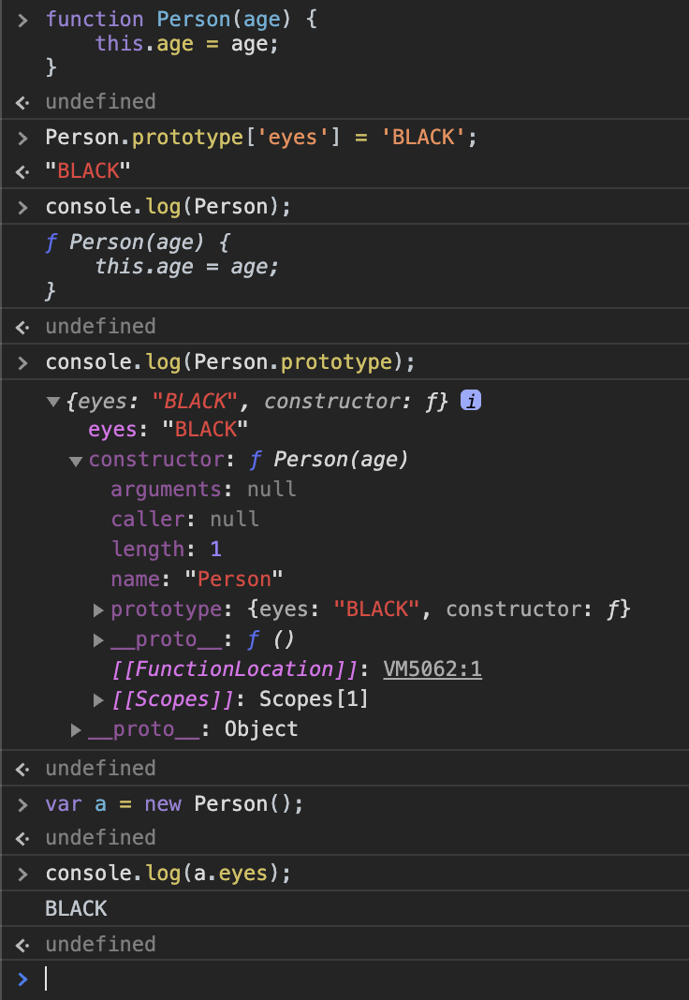
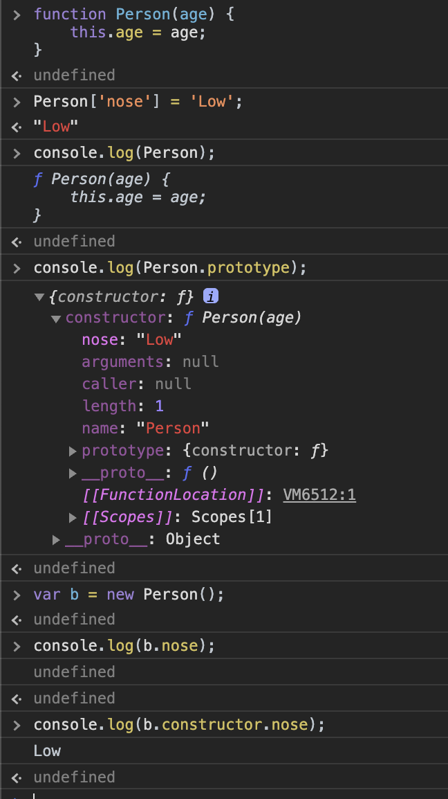
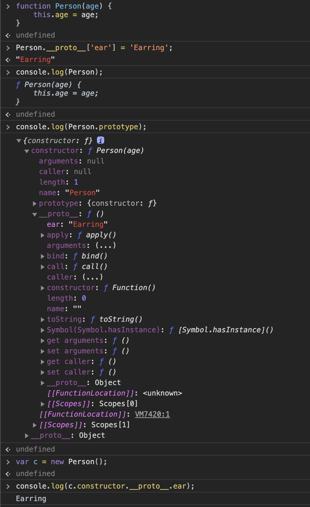
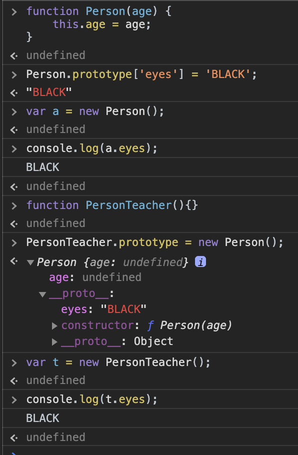
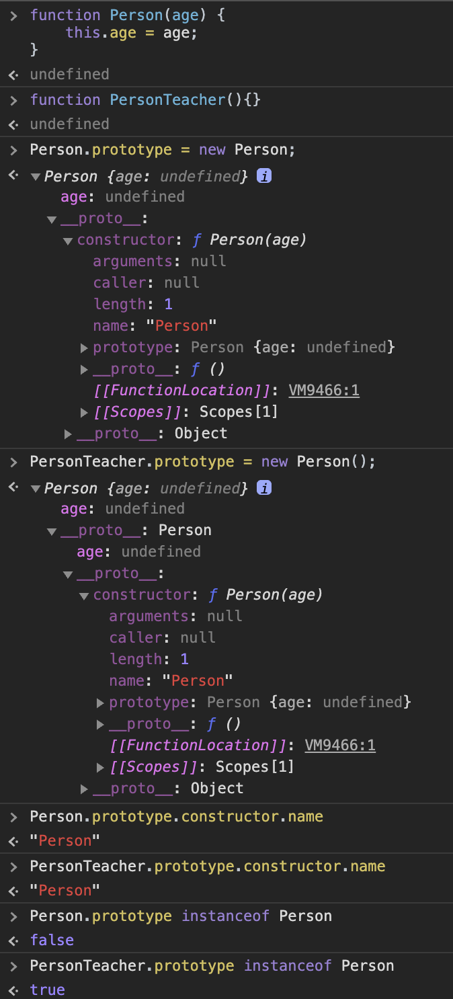
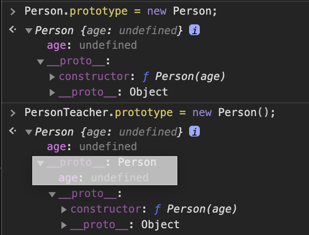
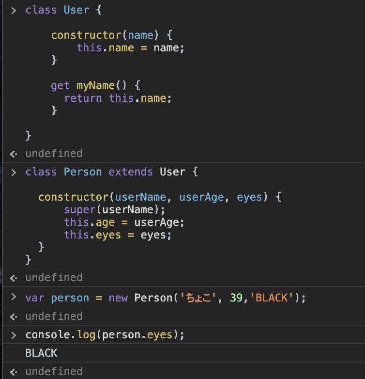
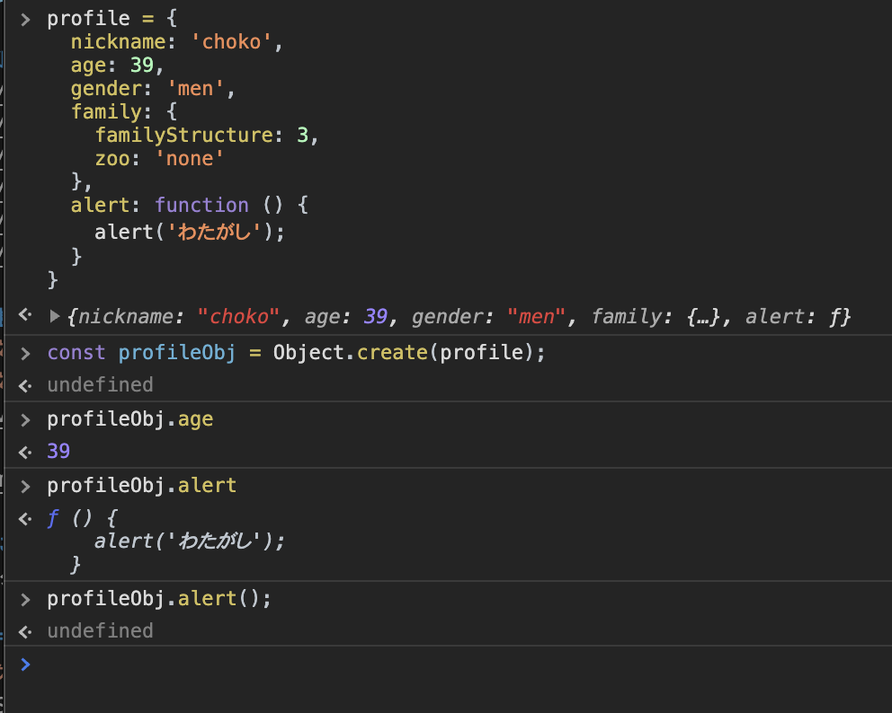

---
titel: 2020-04-30_basic
up date: 2020-04-30
tags:
 - JavaScript
---  

# JavaScript の基本

## オブジェクトの基本  
参考:[オブジェクトの基本](https://developer.mozilla.org/ja/docs/Learn/JavaScript/Objects/Basics)  
### オブジェクト  
```js:basic.js
- オブジェクト名にプロパティを代入
- 最初の3つ(配列、値、文字列)は、オブジェクトのプロパティと呼ぶ
- 最後の1つ(関数名)は、関数で、オブジェクトのメソッドと呼ぶ
- 関数は、オブジェクト内に記述される事でメソッドと呼ぶ
- オブジェクトは、{} で括る
- プロパティは必ず「,」で区切る

オブジェクト名 = {

  プロパティ名: 配列,
  プロパティ名: 値,
  プロパティ名: 文字列,
  メソッド名: 関数名 () {
    // 処理;
  }
}


const person = {

  name: ['choko', 'kana'],
  age: 39,
  gender: 'men',
  profile: function () {
    alert(this.name[0] + this.age + this.gender);
  }
}
```  

### ドットによる記述  
オブジェクト内部のカプセル化されたものにアクセスする方法  
```js:basic.js
- ドット「.」を記述してアクセスする

オブジェクト名.プロパティ;
オブジェクト名.プロパティ[添字];
オブジェクト名.メソッド名();

// 実行
person.age;       // 結果 39
person.name[0];   // 結果 choko
person.profile(); // 結果 choko39men
```  

### 角括弧による記述
```js:basic.js
- ドットによる記述と意味は一緒

// 実行
person['age'];       // 結果 39
person['name[0]'];   // 結果 error
person['profile()']; // 結果 error
```  

### オブジェクト内部のオブジェクト
```js:basic.js
- オブジェクト内部にオブジェクトを持つ事も可能

オブジェクト名 = {
      プロパティ ...
  },

  オブジェクト内部のオブジェクト名: {
    プロパティ名: 値,
    プロパティ名: 文字列
  }
}


const person = {
  name: ['choko', 'kana'],
  age: 39,
  gender: 'men',
  profile: function () {
    alert(this.name[0] + this.age + this.gender);
  },

  family: {
    familyStructure: 5,
    zoo: 'dog'
  }
}


// 実行
person.family.zoo // 結果 "dog"

```  

### オブジェクトメンバーの設定  
オブジェクトのメンバとは
- age: 39 = メンバー
- age = プロパティ = メンバー変数
- 39 = プロパティの値 = メンバーの値
- profile: function () {} = メソッド = メンバー関数

### メンバーの変更
```js:basic.js

// メンバの値を変更
person.age = 45;
person.name[0] = 'puku';

// 実行
person.age;     // 結果 45
person.name[0]; // 結果 puku
```  

### メンバーの追加
```js:basic.js

オブジェクト名['追加したいプロパティ名'] = 追加したい値;
オブジェクト名.追加したいプロパティ名 = 追加したい値;

オブジェクト名['追加したいプロパティ名'] = 追加したい配列;
オブジェクト名.追加したいプロパティ名 = 追加したい配列;

オブジェクト名.追加したいメソッド名 = 追加したい関数;


// オブジェクト person に、メンバ-を追加(角括弧記述、ドット記述)
person['eyes'] = 'BLACK'；
person.eyes = 'BLACK'；

person['nen2'] = ['大阪市','枚方市'];
person.nen = ['大阪市','枚方市'];

// オブジェクト person に、メンバ-関数を追加
person.farewell = function () {
  alert("Bye everybody!");
}

//　追加後のイメージ
const person = {
  name: ['choko', 'kana'],
  age: 39,
  gender: 'men',
  profile: function () {
    alert(this.name[0] + this.age + this.gender);
  },
  family: {
    familyStructure: 5,
    zoo: 'dog'
  },
  eyes: 'BLACK',
  farewell: function () {
    alert("Bye everybody!");
  }
}
```  
### メンバーの追加に変数はプロパティとして追加できない

```js:basic.js
下記を追加してみると

var myDataName = 'height';
var myDataValue = '1.75m';
person[myDataName] = myDataValue;


オブジェクト person には下記が追加される

height: '1.75m' 
```  

### "this" とは？
- "this"は、特別な存在
- オブジェクト内の"this"は、現在のオブジェクトを参照している
- オブジェクト"person" = "this"
- return の戻り値を"this"にした場合、オブジェクトに戻り値を設定した事になる

```js:basic.js
person.name[0] = this.name[0] ということ

const person = {
  name: ['choko', 'kana'],
  profile: function () {
    alert(this.name[0]);
  }
}

// 実行
person.profile(); // 結果 window alert に choko を表示
```

## 初心者のためのオブジェクト指向  
参考：[オブジェクト指向](https://developer.mozilla.org/ja/docs/Learn/JavaScript/Objects/Object-oriented_JS)  

### オブジェクトのテンプレートを定義
```js:image.js
イメージ

　親クラス(設計図)
    ・性別
    ・年齢
    ・氏名
```  
### 実際のオブジェクトの生成
```js:image.js
イメージ

　親クラス(設計図/生徒データ)
    ・性別
    ・年齢
    ・氏名

       ↓（インスタンス可）

  オブジェクト1
  ・男性
  ・39歳
  ・ちょこ

  オブジェクト2
  ・女性
  ・18歳
  ・かな
```  
### 専門のクラス  
親クラスから子クラスに設計内容を継承できる  
```js:image.js
イメージ

　親クラス(設計図/生徒データ)
    ・性別
    ・年齢
    ・氏名

 　    ↓（継承）

　子クラス(設計図/教師データ)
    ・性別
    ・年齢
    ・氏名
    ・専門/継承したクラスにプロパティを追加
```  
## コンストラクター関数  
### コンストラクター関数とは？  
コンストラクター関数：JavaScript版のクラス
```js:basic_2.js
- コンストラクター関数名は、大文字で始まる
- 設計図であり、利用できない状態

function Person(name) {
    this.name = name;
    this.greeting = function () {
        alert("Bye everybody!");
    };
}
```  
### コンストラクター関数を使えるようにする
```js:basic_2.js
インスタンス化：new をコンストラクター関数の前に付ける

- let：変数の入れ物
- person1：変数名
- new：インスタンス化
- Person：コンストラクター関数名
- 'ちょこ'：引数

// パッケージ化
let person1 = new Person('ちょこ');
let person2 = new Person('ぷく');

// 実行
person1.name       // 結果 ちょこ
person1.greeting() // 結果 alertにBye everybody!の表示
person2.name       // 結果 ぷく
person2.greeting() // 結果 alertにBye everybody!の表示
```  

```js:basic_2.js  
オブジェクトが生成された後、変数person1とperson2の中身は何か格納されている？

person1
{
    name: 'ちょこ'
    greeting = function () {
        alert("Bye everybody!");
    }
}

person2
{
    name: 'ぷく'
    greeting = function () {
        alert("Bye everybody!");
    }
}

person1 person2 で毎回 greeting()を定義している
これは、理想的でない
```  

### コンストラクターを少し複雑にしてみる  
```js:basic_2.js

// コンストラクター関数 Person()
function Person(first, last, age, gender) {

    // コンストラクター関数Person内のオブジェクトname
    this.name = {
        first: first,
        last: last
    };

    // 変数に代入
    this.age = age;
    this.gender = gender;

    // コンストラクター内関数内の関数
    this.bio = function () {
        alert(this.name.first + this.name.last + ' is ' + this.age);
    };

    // コンストラクター内関数内の関数
    this.greeting = function () {
        alert('名簿のできあがり!');
    };
}

// それぞれ引数を渡しながらPersonをインスタンス化し代入
let person1 = new Person('ちょこ', 'ぷく', 39, 'men');

// 実行
person1.name; // 結果 ちょこ, ぷく
```  
"this"は、コンストラクター関数内の変数名の前に付ける  

## オブジェクトインスタンスを生成する他の方法  
### Object()コンストラクター  
先に変数を準備して、空のオブジェクトを生成するコンストラクターを代入する  
```js:bas_2.js

// コンストラクターObjectをインスタンス化
let person1 = new Object();

// プロパティの追加
person1.name = 'ちょこぶく';
person1['age'] = 2;

// 実行
person1.name; // 結果 ちょこぶく
```  
### 組み込みメソッドcreate()の使用
既存のオブジェクトを基に新しいオブジェクトを生成することができる
```js:bas_2.js
先に生成したオブジェクトperson1を基にperosn2のオブジェクトを生成
この場合、すでにperson1はインスタンス化されているので、new不要
その変わり、create()関数を使う

let person2 = Object.create(person1);

//実行
person2.age; // 結果 2
```  

## Objectのプロトタイプ
参考：[Objectのプロトタイプ](https://developer.mozilla.org/ja/docs/Learn/JavaScript/Objects/Object_prototypes)  

### プロトタイプベースの言語  
プロトタイプ：後での改良を見込んで、その仕事をする大筋として作る最初の模型

## prototypeプロパティの継承  
プロトタイプチェーン：数珠つなぎに参照している  

```js:basic_3.js
- 継承をinstanceofで確認する

// AとBのコンストラクタ関数を準備
function A() {}
function B() {}

// インスタンス化し代入
var o = new A();

// 実行(比較)
o instanceof A; // 結果 true

// 実行(比較)
o instanceof B; // 結果 false

// 実行(比較)
o instanceof Object;　//　結果　true
// 理由
A.prototype instanceof Object; // 結果 true だから

// 実行(下記は継承関係にない)
A.prototype = {};
var o2 = new A();
o instanceof A;　// 結果 false(oのプロトタイプチェーンの中にA.prototypeは存在しない)

// 実行(継承関係をつくる)
B.prototype = new A(); // B と Aの継承関係ができる
var o3 = new B();
on3 instanceof A; // 結果 true
on3 instanceof B; // 結果 true
```  
つまり、プロトタイプチェーンを利用する事で、それぞれのコントラクタをつなげる事ができる

## コンストラクタのプロパティ  
全てのコンストラクタ関数には、prototypeがあり、その値はconstructorプロパティを含むオブジェクトとなる  

```js:basic_3.js
// コンストラクタ関数
function Person(first, last, age, gender) {
    this.name = {
        first: first,
        last: last
    };
    this.age = age;
    this.gender = gender;
    this.bio = function () {
        alert(this.name.first + this.name.last + ' is ' + this.age);
    };
    this.greeting = function () {
        alert('名簿のできあがり!');
    };
}

 // 引数を与えインスタンス化
let person1 = new Person('ちょこ', 'ぷく', 39, 'men');

// 下記を実行
person1.constructor

// 結果
ƒ Person(first, last, age, gender) {
    this.name = {
        first: first,
        last: last
    };
    this.age = age;
    this.gender = gender;
    this.bio = function () {
        alert(this.name…

と、コンストラクタ関数の中身が見れる

// 続いて、下記実行
var person3 = new person1.constructor('太郎', '山田', 33, 'male');

person1.constructor === Personコンストラクタ関数

なので、new person1.constructor で新たにインスタンスができる
```  
```js:basic_3.js

// 実行
instanceName.constructor.name === person1.constructor.name

// 結果
Person

つまり、インスタンスされたperson1のコンストラクタを参照し、そのコンストラクタ名を結果として出している
```  
## prototypeを使った継承例  
```js:basic_3.js
// 空のオブジェクトを2つ用意
var User = function () {};
var Member = function () {};

// まず、Userオブジェクトに hell()というメソッドを定義する,コントラクト関数
User.prototype.hello = function (name) {
    return name + 'さん、こんにちは！';
}

// インスタンス化しながら、継承(Memberのプロトタイプに代入)
Member.prototype = new User();
    /* 内部的にあるもの(Member.prototypeのコントラクト関数)

        Member.prototype.hello = function(name) {
        return name + 'さん、こんにちは！';
        }

    */

// constructor.prototypeのコントラクタの名前を確認
Member.prototype.constructor.name // User,　継承されている
// constructor.prototypeのコントラクタの存在を確認
Member.prototype instanceof User;  // true, 継承されている

// それぞれのメソッドを使えるようにしてあげるためにインスタンス化
const choko = new User();
const puku = new Member();

console.log(choko.hello('ちょこ'));
console.log(puku.hello('ぷく'));
```  
## プロトタイプの追加と変更（画像参照）  







## クラス構文の継承  
参考：[クラス構文の使い方-侍](https://www.sejuku.net/blog/49551)  
参考：[クラス構文の使い方-MdN](https://developer.mozilla.org/ja/docs/Learn/JavaScript/Objects/Inheritance)  



## JavaScriptによる継承を使用するタイミング  
・複数のオブジェクトの作成が必要となった場合に有効  

## オブジェクトリテラルの継承
参考：[オブジェクトリテラルの継承](https://developer.mozilla.org/ja/docs/Web/JavaScript/Reference/Global_Objects/Object/create)

