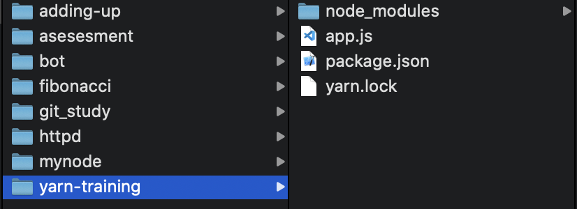

---
titel: 2020-05-04_command
up date: 2020-05-04
tags:
 - commad
 - yarn
 - node.js
---  

# yarn    
- yarn（ヤーン）は、Node.js のためのパッケージマネージャ
- ライブラリのパッケージがインストールされているのかを記録し、新しいパッケージのインストールや削除を簡単に行えるようにするプログラム  
- Node.jsは標準で、npmというパッケージ管理ツールがあるが、yarnはnpmの範囲もカバーしている  
[npm_page](https://www.npmjs.com/)  
[yanr_ver確認](https://www.npmjs.com/package/yarn)
## install  
```
curl -o- -L https://yarnpkg.com/install.sh | bash -s -- --version 1.21.1
```  
install完了後
```  
source ~/.bashrc
```  
## help表示
```  
yarn --help
```  
## yarn base command list
```  
- access
    - add
    - audit
    - autoclean
    - bin
    - cache
    - check
    - config
    - create
    - exec
    - generate-lock-entry / generateLockEntry
    - global
    - help
    - import
    - info
    - init
    - install
    - licenses
    - link
    - list
    - login
    - logout
    - node
    - outdated
    - owner
    - pack
    - policies
    - publish
    - remove
    - run
    - tag
    - team
    - unlink
    - unplug
    - upgrade
    - upgrade-interactive / upgradeInteractive
    - version
    - versions
    - why
    - workspace
    - workspaces
```  
## yarn specific command list
```  
  Options:

    --cache-folder <path>               specify a custom folder that must be used to store the yarn cache
    --check-files                       install will verify file tree of packages for consistency
    --cwd <cwd>                         working directory to use (default: /home/vagrant)
    --disable-pnp                       disable the Plug'n'Play installation
    --emoji [bool]                      enable emoji in output (default: false)
    --enable-pnp, --pnp                 enable the Plug'n'Play installation
    --flat                              only allow one version of a package
    --focus                             Focus on a single workspace by installing remote copies of its sibling workspaces.
    --force                             install and build packages even if they were built before, overwrite lockfile
    --frozen-lockfile                   don't generate a lockfile and fail if an update is needed
    --global-folder <path>              specify a custom folder to store global packages
    --har                               save HAR output of network traffic
    --https-proxy <host>
    --ignore-engines                    ignore engines check
    --ignore-optional                   ignore optional dependencies
    --ignore-platform                   ignore platform checks
    --ignore-scripts                    don't run lifecycle scripts
    --json                              format Yarn log messages as lines of JSON (see jsonlines.org)
    --link-duplicates                   create hardlinks to the repeated modules in node_modules
    --link-folder <path>                specify a custom folder to store global links
    --modules-folder <path>             rather than installing modules into the node_modules folder relative to the cwd, output them here
    --mutex <type>[:specifier]          use a mutex to ensure only one yarn instance is executing
    --network-concurrency <number>      maximum number of concurrent network requests
    --network-timeout <milliseconds>    TCP timeout for network requests
    --no-bin-links                      don't generate bin links when setting up packages
    --no-default-rc                     prevent Yarn from automatically detecting yarnrc and npmrc files
    --no-lockfile                       don't read or generate a lockfile
    --non-interactive                   do not show interactive prompts
    --no-node-version-check             do not warn when using a potentially unsupported Node version
    --no-progress                       disable progress bar
    --offline                           trigger an error if any required dependencies are not available in local cache
    --otp <otpcode>                     one-time password for two factor authentication
    --prefer-offline                    use network only if dependencies are not available in local cache
    --preferred-cache-folder <path>     specify a custom folder to store the yarn cache if possible
    --prod, --production [prod]
    --proxy <host>
    --pure-lockfile                     don't generate a lockfile
    --registry <url>                    override configuration registry
    -s, --silent                        skip Yarn console logs, other types of logs (script output) will be printed
    --scripts-prepend-node-path [bool]  prepend the node executable dir to the PATH in scripts
    --skip-integrity-check              run install without checking if node_modules is installed
    --strict-semver
    --update-checksums                  update package checksums from current repository
    --use-yarnrc <path>                 specifies a yarnrc file that Yarn should use (.yarnrc only, not .npmrc) (default: )
    -v, --version                       output the version number
    --verbose                           output verbose messages on internal operations
    -h, --help                          output usage information
```  
## node_modules install  
- 基本的にライブラリはローカルインストールで行う（現在のディレクトリのみインストールする）

ディレクトリの場所を決める
```  
cd ~/workspace/
git clone git@github.com:自分のGitHubアカウント名/yarn-training.git
cd yarn-training
```  
[axios](https://github.com/axios/axios)をローカルにインストールする
```  
yarn add axios
```  
ディレクトリ状況
  
axiosを使えるようにする(app.jsを実装)
```js:spp.js  
'use strict';
const axios = require('axios');
axios.get('https://www.google.com').then(res => {
  console.log(res.data);
});
```  
実装完了の確認
```   
node app.js
```   
  
これで、yarn使用可能
